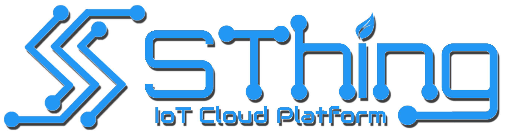

# SEA Cloud Platform - SThing (v0.8)


Format: 

> **Desc :** This platform use for cloud platform was needs in SEAMEO SEAMOLEC. For this version we'll focus to build for IoT cloud platfom

## About Author
- **Name :** Betuah Anugerah
- **Email :** betuahanugerah@gmail.com
- **Github :** [My Github Libraries](https://github.com/betuah/)
<hr>

## Installation
```sh
$ npm install && npm run install
```
##### OR
```sh
$ cd Server
$ npm install
$ cd ..
$ cd Client
$ npm install
```
<hr>

## Environment Setup
> Create .env file in every subfolder like API, Client, Socket and Server

#### Mongo database installation
docker run --name mydb -v YOUR_LOCAL_DIR_PATH:/data/db -p 27017:27017 -d mongo:latest

#### Server .env file
```sh
PORT=8000
NODE_ENV=dev|prod
DOMAIN=http://localhost
TOKEN_SECRET=YOUR_SECRET_TOKEN_PASSWORD
ENCRYPTION_KEY=YOUR_CUSTOM_KEY
CLIENT_DOMAIN=http://localhost:3000
MONGO_DB=db_cloud_platform
MONGO_USERNAME=YOUR_MONGODB_USERNAME
MONGO_PASSWORD=YOUR_MONGODB_PASSWORD
MONGO_HOST=YOUR_MONGODB_HOST
MONGO_PORT=YOUR_MONGODB_PORT
```
##### Server serviceAccountKey (For Firebase Admin Config)
Create json file with name serviceAccountKey.json in 'Server/config' directory and add as bellow
```sh
{
  "type": "service_account",
  "project_id": "YOUR_FIREBASE_PROJECT_ID",
  "private_key_id": "YOUR_FIREBASE_PRIVATE_KEY_ID",
  "private_key": "YOUR_FIREBASE_PRIVATE_KEY",
  "client_email": "YOUR_FIREBASE_CLIENT_EMAIL",
  "client_id": "YOUR_FIREBASE_CLIENT_ID",
  "auth_uri": "YOUR_FIREBASE_AUTH_URI",
  "token_uri": "YOUR_FIREBASE_TOKEN_URI",
  "auth_provider_x509_cert_url": "YOUR_FIREBASE_auth_provider_x509_cert_url",
  "client_x509_cert_url": "YOUR_FIREBASE_client_x509_cert_url"
}

```

#### Client .env file
```sh
NODE_PATH=src/
NODE_ENV=development
REACT_APP_CLIENT_DOMAIN=http://localhost:3000
REACT_APP_SERVER_DOMAIN=http://localhost:8000
REACT_APP_IOT_GATEWAY_DOMAIN=http://localhost:5000
REACT_APP_SOCKET_DOMAIN=http://localhost:4000
REACT_APP_FIREBASE_APIKEY='YOUR_FIREBASE_APIKEY'
REACT_APP_FIREBASE_AUTH_DOMAIN='YOUR_FIREBASE_AUTH_DOMAIN'
REACT_APP_FIREBASE_DATABASE_URL='YOUR_FIREBASE_DATABASE_URL'
REACT_APP_FIREBASE_PROJECT_ID='YOUR_FIREBASE_PROJECT_ID'
REACT_APP_FIREBASE_STORAGE_BUCKET='YOUR_FIREBASE_STORAGE_BUCKET'
REACT_APP_FIREBASE_MESSAGING_SENDER_ID='YOUR_FIREBASE_MESSAGING_SENDER_ID'
REACT_APP_FIREBASE_APP_ID='YOUR_FIREBASE_APP_ID'
REACT_APP_FIREBASE_MEASUREMENT_ID='YOUR_FIREBASE_MEASUREMENT_ID'
```

#### IoT Gateway .env file
```sh
PORT=5000
DOMAIN=http://localhost
MQTT_BROKER_DOMAIN=mqtt://localhost:6000
MQTT_ADMIN_SECRET=YOUR_MQTT_ADMIN_SECRET
TOKEN_SECRET=YOUR_SECRET_TOKEN_PASSWORD
ENCRYPTION_KEY=YOUR_CUSTOM_KEY
MONGO_DB=db_cloud_platform
MONGO_USERNAME=YOUR_MONGODB_USERNAME
MONGO_PASSWORD=YOUR_MONGODB_PASSWORD
MONGO_HOST=YOUR_MONGODB_HOST
MONGO_PORT=YOUR_MONGODB_PORT
REDIS_HOST=YOUR_REDIS_HOST
REDIS_PORT=YOUR_REDIS_PORT
REDIS_PASSWORD=YOUR_REDIS_PASSWORD
SOCKET_DOMAIN=http://localhost:4000
CLIENT_DOMAIN=http://localhost:3000
```
IoT Gateway also need redis for store temporary data from device, here is we pull and run redis from docker
```sh
docker pull redis:alpine
docker run --name myredis -p 6379:6379 -d redis:alpine
```

#### SocketIO .env file
```sh
PORT=4000
DOMAIN=http://localhost
TOKEN_SECRET=YOUR_SECRET_TOKEN_PASSWORD
CLIENT_DOMAIN=http://localhost:3000
SERVER_DOMAIN=http://localhost:8000
API_DOMAIN=http://localhost:5000
URL_DOMAIN=http://localhost
MONGO_DB=db_cloud_platform
MONGO_USERNAME=YOUR_MONGODB_USERNAME
MONGO_PASSWORD=YOUR_MONGODB_PASSWORD
MONGO_HOST=YOUR_MONGODB_HOST
MONGO_PORT=YOUR_MONGODB_PORT
```
<hr>

## Running APP
> **Note:** Firstly make sure your mysql server is running well!

```sh
$ npm run start 
```

<hr>

# Version Log
## Version Change log (STHING_v08)
- Change notif status iot_device controller in IoT Gateway
- Add Notification component in client
- Add show single notif component in client
- Add show all notif component in client
- Add Checkbox in list item showAllNotif component
- Add mark as read and delete button in showAllNotif component
- Scrollbar css custom
- Add InfiniteScroll and prefect scroll bar
- Add spinner for loading component
- Add read notif feature in ShowAllNotif component
- Add delete notif feature in ShowAllNotif compoent
- Change token store from localstorage to cookie
- Encrypt JWT token to client
- Set CSRF with CSURF
- Fix axios request header at Device,controller and graph list
- Add link on resource sidenav menu
- Add logo and fix layout in login component
- Remove event on feature in widget controller component

## Version Change log (STHING_v07)
- Add subscriptions in IoT Gateway controller
- Set device data in published payload in auth aedes
- Remote data schema from graph model
- Fix dataId in graph_data event on socketIO app
- Fix dataId and dataValue undefine in visualizaition graph
- Add iot_deviceData controller in Iot Gateway
- Change userSettings Model to usersData model
- Create data in usersModel if new user registered
- Fix userSettings controller
- Add new event with name notif_event and notification event in socketIO
- Add notif_event in auth context commponent in client
- Add redis as data cache form device
- Add encryption for SMTP Email Password
- Add sendMail function in iot gateway controller
- Fix switch tls and secure in setting component

## Version Change log (STHING_v06)
- Add editable and dragable widget setting in edit widget modal
- Add api_url in server origin and .env
- Add Feature test mail
- Add loading btn in profile and settings component
- Add send to mail modal in settings component
- Add MQTT Broker with Aedes
- Fix search bugs issue when search any sugestion with symbol getting error (Search at device, visualization, & Controller list)
- Websocket (SockerIO) change function for handle device state, get status from mqtt broker
- Add Security like authentication and authorization for publisher and subscriber for MQTT Broker (Aedes)
- Fix issue triple show notif device status pop up
- Fix error fetch data from world time zone
- Change port Aedes to 6000
- Change API to IoT Gateway

## Version Change Log (STHING_v05)
- Add New logo brand
- Adding Setting Component
- Encrypt roles id Auth_controller
- Update .env file in Server, Client, socket, and API
- Change port Socket to 4000 and API to 5000
- Decrypt roles id in middleware
- Adding user settings model
- Adding user settings route for API end point
- Adding indexes in all collection of mongodb
- Fix timeZone settings
- Set timeZone for Device
- Add Action Max/Min feature in visualization
- Add Draggable feature in edit modal visualization
- Change Main and graph widget Layout in visualization component
- Change Main and controller widget Layput in visualization component
- Change Device Component layout
- Fix top and bottom margin in controller list and device list component
- Change graph model (Adding settings field)
- Change controller model (Adding _id and insert with random string from uuid)
- Add initTimeZoneList function (call API from worldtime API)
- Load timeZone list from header (Call function initTimeZoneList from Auth Context)

## Version Change Log (v0.4.1)
- Modify register, login and reset layout and UI
- Change authentication methode to firebase auth
- Add signin with email firebase
- Add signin with google firebase
- Add register data to realtime database firebase
- Fix profile bug issue (Not showing profile like name or photo at the fisrt time login)
- Add Profile commpoent with Personal Information, Change Photo Profile and Change Password

## Version Change Log (v0.3.2)
- Add event on in controller feature
- Fix any bug in controller

## Version Change Log (v0.3.1)
- Fix socket io device status
- Add delete confirmation in all component list
- Add Editable Widget

## Version Change Log (v0.3.0)
- Add Layout for controller list
- Add widget feature
- Add default controller
- Add Edit and adding button features

## Version Change Log (v0.2.4)
- Fix layout bug
- Fix visualization route in front end
- Fix issue default graph in graph list

## Version Change Log (v0.2.3)
- Modify Edit widget menu
- Add graph template (Clean Text and Proggress Bar)
- Fix UI bug in Progress Bar value

## Version Change Log (v0.2.2)
- Add widget menu
- Modify Edit widget menu
- Add graph template (gauge, tachometer)
- Remove resourceId room and change it to own userId room
- Fix Any bug such is edit widget will delete all widget, join in multiple room and get wrong target for graph value
- Upgrade Client package.json
    - ReactJS (v16.8.6)
    - ReactJS-DOM (v16.8.6)
    - @material {core, lab, icon} (v4.9.5)
    - Antd (v4.0.2)
    - React-Scripts (v3.4.0)
    - @material { elevation,typography } (v5.1.0)
    - react-app-rewired (v2.1.5)
    - react-hot-loader (v4.12.19)
- Add new packages
    - customize-cra (v3.6.4) -dev
    - @babel/runtime (v7.0.0) -dev
    - less-loader (v5.0.0) -dev

## Version Change Log (v0.2.1)
- Add Real Time device status
- Add Copy token button
- Fix device module (Device Menu)
- Fix Flooding to device API
- Change dashboard menu
- Add Graph menu

<hr>

# Enjoy!

<hr>